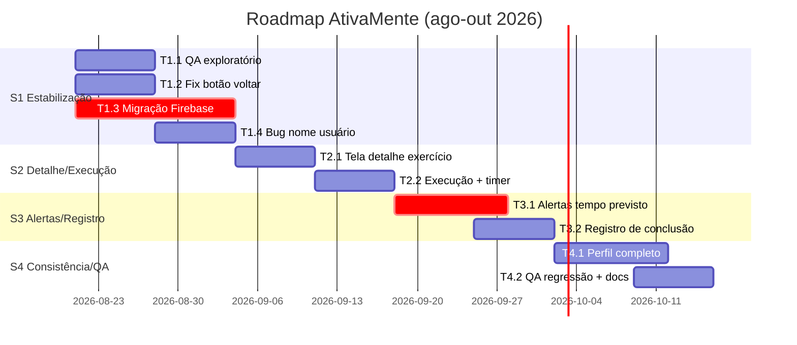

# Plano de Sprints — AtivaMente (App Flutter)

> **Convenções:**
> - Sprint = **15 dias**, iniciando e terminando na **sexta-feira**. A sexta de fronteira concentra review da sprint anterior + planning da seguinte.
> - Tarefas dimensionadas em **1 ou 2 semanas**; cada sprint comporta ~2–3 tarefas.
> - Rastreabilidade: toda tarefa referencia User Stories (`docs/user-stories.md`) e, quando aplicável, issues do repositório.
> - Datas baseadas no calendário de 2026 (21/08/2026 é sexta).

---

## Visão geral dos milestones

| Milestone | Sprint | Período | Tema |
|---|---|---|---|
| M1 | S1 | sex 21/08 → sex 04/09/2026 | Estabilização & Infraestrutura (QA, navegação, Firebase Labican) |
| M2 | S2 | sex 04/09 → sex 18/09/2026 | Detalhe do exercício & execução marcada |
| M3 | S3 | sex 18/09 → sex 02/10/2026 | Tempo previsto, alertas acessíveis e registro de conclusão |
| M4 | S4 | sex 02/10 → sex 16/10/2026 | Consistência de perfil & QA de regressão |

---

## Sprint 1 — Estabilização & Infraestrutura (21/08 → 04/09)

**Objetivo:** app navegável sem bugs bloqueantes e rodando sobre o projeto Firebase oficial do Labican.

### T1.1 — Teste exploratório completo do app *(1 semana)*
- **US relacionadas:** todas (insumo para priorização) · **Issue:** a criar (`docs` de teste)
- **Descrição:** percorrer todos os fluxos do app e registrar o que funciona e o que não funciona.
- **Roteiro mínimo:**
  1. Welcome → Login → Home (nome carrega? rotas protegidas?)
  2. Cadastro de conta nova → documento `Pessoas` criado?
  3. Admin: adicionar usuário nos 3 papéis; seed idempotente?
  4. Treino: abas Coração/Músculo filtram? voltar funciona? tap em exercício?
  5. Perfil: dados exibidos? logout?
  6. TTS em cada tela.
- **Dispositivos:** Android físico/emulador + Web (Chrome).
- **Entregável:** `docs/qa-matriz-testes.md` com matriz tela × funcionalidade × status (✔/✖/parcial) + evidências.
- **DoD:** matriz publicada; bugs convertidos em issues.

### T1.2 — Correção do botão voltar da tela de treino *(1 semana, paralela à T1.1)*
- **US:** US10 · **Prioridade:** Alta
- **Descrição:** substituir `context.pop()` por `context.go('/home')` em `workout_screen.dart`; revisar demais usos de pop após navegação via `go`.
- **DoD:** voltar retorna à Home; padrão de navegação (`go` vs `push`) documentado no README ou comentário de rota.

### T1.3 — Migração do Firebase para a conta oficial Labican *(2 semanas)* ⚠ crítico
- **US:** US09 · **Decisão:** projeto novo + re-seed (sem migração de dados)
- **Passos:**
  1. Criar projeto (ex.: `ativamente-labican`) na conta oficial do laboratório; convidar mantenedores como owners/editors.
  2. Ativar **Authentication (e-mail/senha)** e **Firestore** (modo produção).
  3. `flutterfire configure` logado na conta Labican → regenerar `lib/firebase_options.dart`, `android/app/google-services.json` e iOS `GoogleService-Info.plist`.
  4. Atualizar referências de `projectId` em `firebase.json` (hoje `ativamente-97e20`) e limpar cache `.firebase/hosting.*.cache`.
  5. Definir regras Firestore iniciais (usuário lê/escreve apenas o próprio doc `Pessoas/{uid}`; coleção `Exercicios` somente leitura para usuários autenticados).
  6. Rodar seed (admin/trainer + exercícios) e validar login/cadastro/lista em device real.
  7. Após validação: desativar/remover apps do projeto pessoal antigo (decisão final do responsável pela conta).
- **Riscos:** chaves antigas versionadas no histórico do git (considerar rotação); configurações de plataforma (SHA-1 Android para futuras integrações).
- **DoD:** app conectado ao projeto Labican; fluxo auth+lista validado em device; nenhum artefato apontando para `ativamente-97e20`.

### T1.4 — Diagnóstico e correção do bug do nome do usuário *(1 semana, 2ª semana da sprint)*
- **US:** US05 🐞 · **Prioridade:** Alta
- **Descrição:** investigar por que `userDataProvider` não entrega o nome (doc `Pessoas` ausente? regras bloqueando? campos vazios?), aplicar fallback (`displayName`/e-mail) e autocriação do documento quando faltante.
- **DoD:** critérios de aceite da US05 atendidos; caso de teste adicionado à matriz de QA.

---

## Sprint 2 — Detalhe do Exercício & Execução Marcada (04/09 → 18/09)

### T2.1 — Tela de detalhe do exercício *(1 semana)*
- **US:** US08 · **Prioridade:** Alta
- **Escopo:** rota `/exercise/:id`; layout com placeholder de mídia (vídeo/GIF futuro), nome, descrição, categoria/tipo; navegação via `push` (voltar preserva aba selecionada).
- **DoD:** tap no card abre detalhe; voltar funcional; TTS cobre a nova tela.

### T2.2 — Marcação de exercício em execução + timer automático *(1–2 semanas)*
- **US:** US11 · **Prioridade:** Alta
- **Escopo:** estado global (Riverpod) de "exercício em execução"; indicador visual na lista/detalhe; cronômetro inicia ao marcar; um exercício por vez; opção de cancelar.
- **Dependência:** T2.1.
- **DoD:** critérios da US11; estado sobrevive a troca de aba dentro da sessão.

---

## Sprint 3 — Tempo Previsto, Alertas & Registro (18/09 → 02/10)

### T3.1 — Tempo previsto + diálogo de conclusão + alertas sonoros/visuais *(~1,5–2 semanas)* ⚠ crítico
- **US:** US12 · **Prioridade:** Alta
- **Escopo:**
  - Parser da `descricao` ("X min", "Nx de Y repetições") para duração prevista; estimativa configurável por exercício quando for por repetição.
  - Ao atingir o previsto: diálogo "Você concluiu este exercício?" (Sim / Ainda não).
  - Se continuar além do previsto: lembretes recorrentes **visuais + sonoros** em intervalos configuráveis (ex.: a cada 2 min), pensados para idosos (texto grande, som claro, opcionalmente narrados via TTS).
- **Risco:** parse impreciso de descrições livres → mitigação: padronizar seed (T1.3/US09) e prever campo estruturado no futuro (US20).
- **DoD:** cenários "dentro do tempo" e "tempo excedido" demonstrados em device.

### T3.2 — Registro de conclusão no Firestore *(1 semana)*
- **US:** US13 · **Prioridade:** Média
- **Escopo:** gravar `RegistroAtivDia` (data, horaInicio, duração, refs pessoa/exercício) ao confirmar conclusão; marcar exercício como realizado na lista; tratar falha de rede.
- **DoD:** registro visível no console Firestore; UI reflete status realizado.

---

## Sprint 4 — Consistência de Perfil & Qualidade (02/10 → 16/10)

### T4.1 — Perfil com dados completos *(~1,5 semanas)*
- **US:** US06 (escopo mínimo: exibir; edição se houver folga) · **Prioridade:** Média
- **Escopo:** Perfil exibe altura, peso, data de nascimento e demais campos existentes no documento; consistência do nome entre telas (Home, Perfil, cabeçalhos).

### T4.2 — QA de regressão + atualização de documentação *(1 semana)*
- **Descrição:** reexecutar matriz completa (`qa-matriz-testes.md`) incluindo os novos fluxos (detalhe, execução, alertas, registro); atualizar `user-stories.md` e `README.md`; fechar issues resolvidas.
- **DoD:** matriz atualizada sem itens críticos abertos; release tag da iteração.

---

## Definition of Done (todas as tarefas)

1. Critérios de aceite das US relacionadas marcados e verificados em device Android.
2. `flutter analyze` sem erros/warnings novos.
3. Navegação testada nos dois sentidos (ida/volta).
4. Novas telas cobrem TTS ("Ler tela") e textos grandes legíveis.
5. Sem segredos/chaves hardcoded; configs sensíveis fora do git.
6. Documentação impactada atualizada (user-stories, matriz QA, README se aplicável).

## Dependências e riscos

| Item | Impacto | Mitigação |
|---|---|---|
| T1.3 (Firebase) bloqueia validações em device das sprints seguintes | Alto | Executar desde o dia 1 da S1; seed local de contorno enquanto isso |
| Parse de descrição p/ tempo previsto (T3.1) pode ser impreciso | Médio | Padronizar seed; campo estruturado previsto na US20 |
| Conta pessoal antiga com dados de teste ativos | Baixo | Desativar após validação do novo projeto |
| Acesso admin à conta Labican ainda não concedido a todos | Médio | Solicitar convites no início da S1 |

## Pós-S4 (próximo ciclo — sugestão)

- US16 Treinos na Rua · US17 Treinos Sugeridos · US18 Progresso (consome `RegistroAtivDia`) · US19 Notificações · US20 alinhamento ao modelo conceitual do backend (integração com a API Django quando disponível).
